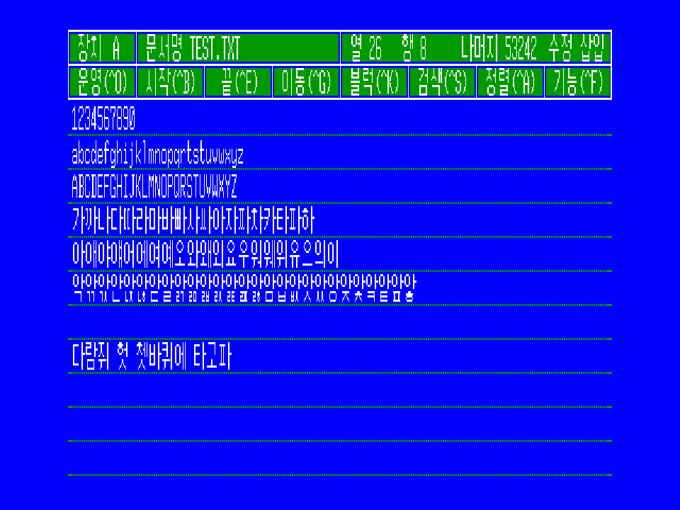
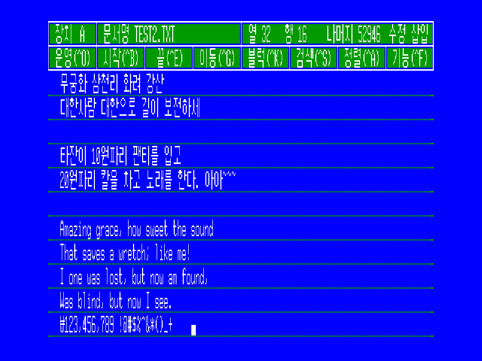

# johab-reader

2바이트 조합형 한글 읽어보기 예제

## 핵심 코드

```python
def divideJaso(b1, b2):
    """
    한글 음절을 초성, 중성, 종성으로 분리

    :param b1: 한글의 첫번째 바이트
    :param b2: 한글의 두번째 바이트
    """
    if b1 & 0x80 == 0:
        raise Exception("b1, b2 is not Korean")
    
    b51 = (b1 >> 2) & 0x1F  # 처음 5비트
    b52 = (b1 & 0x03) << 3 | b2 >> 5 # 중간 5비트 (2 + 3비트)
    b53 = b2 & 0x1F # 마지막 5비트    
    return (b51, b52, b53)

CHOSUNG = [0, 1, 2, 3, 4, 5, 6, 7, 8, 9, 10, 11, 12, 13, 14, 15, 16, 17, 18]
JUNGSUNG = [0, 1, 2, 3, 4, 5, 6, 5, 6, 7, 8, 9, 10, 11, 11, 11, 12, 13, 14, 15, 16, 17, 17, 17, 18, 19, 20, 21]
JONGSUNG = [0, 1, 2, 3, 4, 5, 6, 7, 8, 9, 10, 11, 12, 13, 14, 15, 16, 17, 17, 18, 19, 20, 21, 22, 23, 24, 25, 26, 27]

def composeHangul(b51, b52, b53):
        i1 = CHOSUNG[b51- 2]
        i2 = JUNGSUNG[b52 - 3]
        i3 = JONGSUNG[b53 - 1]        
        unicode = 0xAC00 + (i1 * 21 + i2) * 28 + i3
        return chr(unicode)
```

## 예제



```
1234567890
abcdefghijklmnopqrtstuvwxyz
ABCDEFGHIJKLMNOPQRSTUVWXYZ
가까나다따라마바빠사싸아자짜차카타파하
아애야얘어에여예오와왜외요우워웨위유으의이
악앆앇안앉않앋알앍앎앏앐앑앒앓암압앖앗았앙앚앛앜앝앞앟

다람쥐 헌 쳇바퀴에 타고파
```



```
File:  test2.txt
                                     애  국   가
                                                                         안익태
  동해물과 백두산이 마르고 닳도록
  하느님이 보우하사 우리나라 만세

  무궁화 삼천리 화려 강산
  대한사람 대한으로 길이 보전하세

  타잔이 10원짜리 팬티를 입지 않았다.

  Amazing grace, how sweet the sound
  That saves a wretch; like me!
  I one was lost, but now am found,
  Was blind, but now I see.
  \123,456,789 !@#$%^&*()_+
```